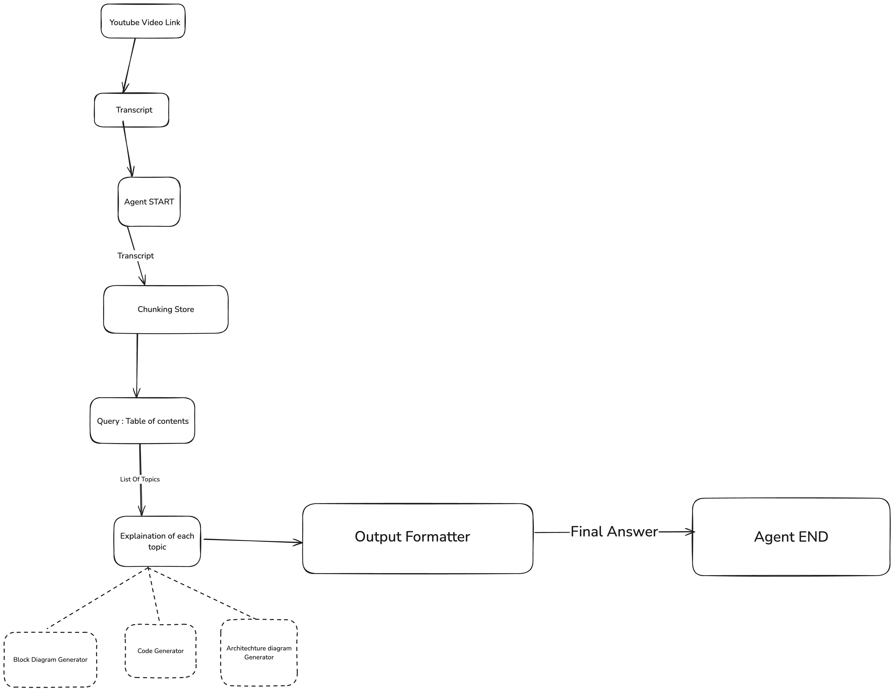

# CineNotes

## Basic Workflow
Below is the visual representation of the CineNotes workflow:



### Workflow Explanation
1. **YouTube Video Link**: Start by providing a link to the YouTube video you want to analyze.
2. **Transcript Generation**: The system extracts the transcript from the video.
3. **Agent START**: Initiates processing of the transcript.
4. **Chunking Store**: The transcript is divided into manageable chunks for further processing.
5. **Query: Table of Contents**: Users can query for a structured table of contents.
6. **Explanation of Topics**:
    - Each topic from the table of contents is analyzed and explained in detail.
    - Additional tools include:
        - **Block Diagram Generator**
        - **Code Generator**
        - **Architecture Diagram Generator**
7. **Output Formatter**: Formats the explanation into a cohesive final output.
8. **Agent END**: Delivers the final, formatted answer.

### Features
- Visual representation of workflows.
- Automatic transcript processing and chunking.
- Table of contents and detailed explanations of topics.
- Additional tools for generating diagrams and code.

### Getting Started
1. Clone this repository:
   ```bash
   git clone https://github.com/your-repo/cinenotes.git